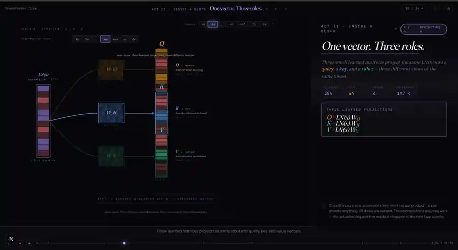
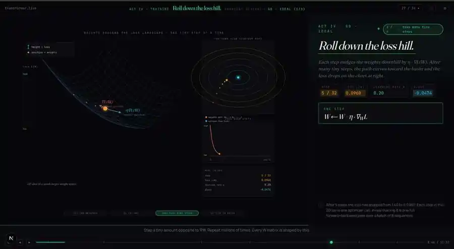

# Transformer From Scratch + Interactive LLM Visualizer

[](https://github.com/pegg-dot/Transformer/actions/workflows/smoke.yml)

I built a GPT-style transformer from scratch in raw PyTorch to understand what happens inside a language model, trained it on Tiny Shakespeare, instrumented the model to capture its internal activations, and then built an interactive browser visualizer around those real model outputs.

The project is meant to be inspectable. You can run the visualizer locally, read the model implementation, retrain the model, capture a forward pass, and export the trained network to ONNX for browser inference.

> **Fastest way to see the project:** clone the repo, enter `viz/`, install dependencies, and run `npm run dev`. No API keys or backend are required.

<p align="center">
  
</p>

<p align="center"><em>Inside a transformer block: the same normalized representation is projected into query, key, and value vectors.</em></p>

## What this project demonstrates

The repository connects two sides of an LLM that are often learned separately:

1. **The model itself** — embeddings, causal self-attention, Q/K/V projections, multiple attention heads, feed-forward networks, residual connections, layer normalization, logits, and autoregressive sampling.
2. **A visual explanation of the forward pass** — an interactive Next.js experience that turns those operations into a guided sequence of 2D and 3D scenes.

The trained model is deliberately small so the entire system is understandable and runnable on a laptop. It is a **10.79M-parameter, character-level GPT-style model** with 6 transformer blocks, 6 attention heads, a 384-dimensional residual stream, and a 256-token context window. The current checkpoint was trained for 5,000 iterations on Tiny Shakespeare and reached approximately **1.05 train loss / 1.50 validation loss**.

## What is real model data vs. explanatory material?

The visualizer uses activations captured from the PyTorch model for core concepts including token/position embeddings, Q/K/V, attention scores and weights, residual-stream states, feed-forward activations, logits, and sampling.

Some scenes also explain concepts that are important in larger production LLM systems, such as **KV caching**. Those scenes are educational extensions of the walkthrough. The small training model in `model/gpt.py` performs straightforward autoregressive decoding and does not implement a production-style KV cache.

That distinction is intentional: the project starts from a minimal transformer that can be read end-to-end, then uses the visualizer to connect it to concepts used by modern LLMs.

## Run the visualizer locally

### Prerequisites

- Node.js 20+
- npm
- Git

### Start the app

```bash
git clone https://github.com/pegg-dot/Transformer.git
cd Transformer/viz
npm install
npm run dev
```

Open **http://localhost:3000**.

The app is self-contained. The ONNX model, vocabulary, ONNX Runtime assets, and captured activations used by the visualization are already included under `viz/public/`.

### Production build

```bash
npm run build
npm run start
```

Linting:

```bash
npm run lint
```

## Run the PyTorch model

The frontend is the quickest demo, but the underlying model can also be run independently.

### 1. Create a Python environment

Python 3.11+ is recommended.

```bash
cd Transformer
python -m venv .venv
source .venv/bin/activate
pip install -r requirements-model.txt
```

On Windows PowerShell, activate with:

```powershell
.venv\Scripts\Activate.ps1
```

### 2. Train the model

```bash
python -m model.train
```

The Tiny Shakespeare corpus is downloaded automatically on first use. The default configuration trains for 5,000 iterations and writes the checkpoint to `checkpoints/gpt.pt`.

For a quick sanity run:

```bash
python -m model.train --max_iters 100
```

### 3. Generate text from a checkpoint

```bash
python -m model.sample --prompt "ROMEO:" --tokens 300
```

Optional sampling controls:

```bash
python -m model.sample --prompt "ROMEO:" --tokens 300 --temperature 0.8 --top_k 40
```

### 4. Capture internal activations

```bash
python -m model.capture --prompt "ROMEO:" --tokens 40 --out model/activations.json
```

The capture pipeline attaches hooks externally to the trained model and records tensors used by the visualizer, including Q/K/V, attention scores and weights, layer-normalization outputs, residual states, feed-forward activations, and logits.

### 5. Export to ONNX

```bash
python -m model.export_onnx --out model/model.onnx
```

The export script also checks the ONNX output against PyTorch on multiple sequence lengths and fails if numerical agreement is outside its tolerance.

## Repository map

```text
.
├── README.md                 # start here
├── requirements-model.txt    # Python dependencies for model workflows
├── model/
│   ├── gpt.py                # transformer implementation
│   ├── config.py             # model/training configuration
│   ├── data.py               # Tiny Shakespeare + tokenizer + batching
│   ├── train.py              # training loop
│   ├── sample.py             # autoregressive generation
│   ├── hooks.py              # activation capture hooks
│   ├── capture.py            # writes captured forward-pass data
│   └── export_onnx.py        # PyTorch -> ONNX + numerical verification
├── viz/
│   ├── app/                  # Next.js routes
│   ├── components/           # movie scenes and interactive visualizations
│   ├── lib/                  # data loading and browser-inference utilities
│   └── public/               # ONNX model + captured activations + runtime assets
├── docs/
│   ├── architecture.md       # model/viz architecture
│   ├── glossary.md           # transformer terminology
│   └── resources.md          # learning references
├── scripts/                  # verification, compression, and ONNX utilities
├── PROJECT_STATE.md          # detailed development history and internal state log
└── ROADMAP.md                # earlier project roadmap / possible extensions
```

## How the pieces connect

```text
Tiny Shakespeare
      |
      v
raw PyTorch GPT
      |
      +---- forward hooks ----> captured activations JSON
      |
      +---- ONNX export ------> browser-runnable model
                                |
                                v
                         Next.js visualizer
                                |
                  2D + 3D guided walkthrough
```

The separation is deliberate. The Python side owns the model and numerical truth. The TypeScript/React side turns that information into an interactive explanation.

## Model architecture

The implementation in `model/gpt.py` is intentionally small and direct rather than abstracted behind a high-level transformer library.

- Character-level tokenizer
- Learned token embeddings
- Learned positional embeddings
- 6 transformer blocks
- 6 causal self-attention heads per block
- 384-dimensional residual stream
- Feed-forward network in each block
- Pre-norm residual connections
- Final layer norm + language-model head
- Autoregressive next-token generation

It does **not** use Hugging Face `transformers` or `torch.nn.Transformer` for the core architecture.

## Visualizer architecture

The browser experience is built with:

- Next.js 16 + React 19
- TypeScript
- Tailwind CSS
- D3.js
- Three.js / react-three-fiber
- Framer Motion
- ONNX Runtime Web

It includes a guided multi-scene walkthrough covering tokenization, embedding space, Q/K/V, causal attention, multi-head attention, feed-forward layers, transformer stacking, next-token sampling, and modern decoding concepts.

<p align="center">
  
</p>

<p align="center"><em>Training view: gradient descent is shown as repeated small weight updates moving down the loss surface.</em></p>

## Deployment

The visualizer is a Next.js application with no application backend and is set up for Vercel.

### Vercel dashboard

1. Import this GitHub repository into Vercel.
2. Set the **Root Directory** to `viz`.
3. Keep the detected framework as **Next.js**.
4. No secrets or API keys are required.
5. Deploy.

### Vercel CLI

From `viz/`:

```bash
npm install
npm run build
npx vercel
```

For a production deployment:

```bash
npx vercel --prod
```

`viz/vercel.json` sets long-lived cache headers for the larger static model and activation assets.

Other Node hosts that support Next.js can also run the project using `npm run build` followed by `npm run start`, but Vercel is the repository's prepared deployment path.

## Verification already built into the project

This repo includes checks intended to keep the visualization tied to the underlying model instead of turning into a disconnected animation:

- activation-schema and tensor-shape verification
- causal-mask and attention-softmax checks
- residual-stream arithmetic checks
- ONNX-vs-PyTorch numerical comparison
- compact activation-data generation for browser delivery
- browser-ready ONNX assets committed with the visualizer

See `scripts/` and `viz/PERF_AUDIT.md` for the supporting utilities and performance notes.

## Why I built it

The goal was not to build a competitive language model. It was to make the transformer stack concrete enough that I could trace what happens to a token instead of treating an LLM as a black box.

Building the model first made the visualizer useful for a second reason: the diagrams could be connected back to tensors produced by code I had implemented and trained myself.

## Current scope

The core project is complete as a small educational transformer + interactive visualization. `ROADMAP.md` and parts of `PROJECT_STATE.md` contain earlier ideas for extending the project toward Llama-style architectural changes, fine-tuning, and reinforcement-learning experiments. Those are possible future extensions, not prerequisites for running or understanding the current repository.
